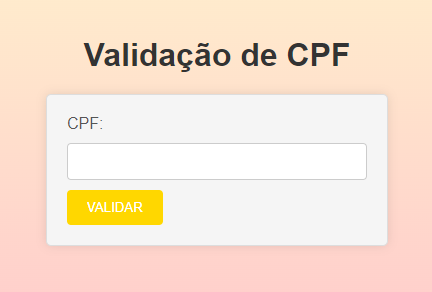
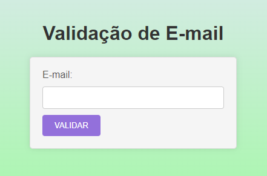

# Projeto de Validação de Email e CPF

## Índice
- [Descrição](#descrição)
- [Introdução](#introdução)
- [Funcionalidades](#funcionalidades)
- [Interface](#interface)
- [Tecnologias Utilizadas](#tecnologias-utilizadas)
- [Autor](#autor)

## Descrição
Este projeto tem como objetivo demonstrar a validação de CPF e Email utilizando JavaScript. Ele foi desenvolvido como parte de uma atividade em sala de aula e serve como exemplo prático de como aplicar técnicas de validação em formulários web.

## Introdução
A validação de dados é uma parte essencial do desenvolvimento de aplicações web. Este projeto contém dois exemplos de validação:
1. Validação de CPF
2. Validação de Email
Cada exemplo está documentado de forma separada, explicando os recursos JavaScript utilizados.

## Funcionalidades
### Validação de CPF
- Recebe um número de CPF e valida se é um CPF válido de acordo com os critérios de formação do documento.
- Exibe uma mensagem indicando se o CPF é válido ou inválido.

### Validação de Email
- Recebe um endereço de email e valida se contém os caracteres essenciais (`@` e `.`).
- Exibe uma mensagem indicando se o email é válido ou inválido.

## Interface

### Validação de CPF

A interface consiste em um formulário simples onde o usuário pode inserir seu CPF e verificar sua validade. A página exibe uma mensagem com o resultado da validação.

### Validação de Email

A interface consiste em um formulário onde o usuário pode inserir seu email. Ao perder o foco do campo de entrada, a validação é realizada e o resultado é exibido.

## Tecnologias Utilizadas
- HTML5
- CSS3
- JavaScript

## Autor
- João Pedro Gonçalves
